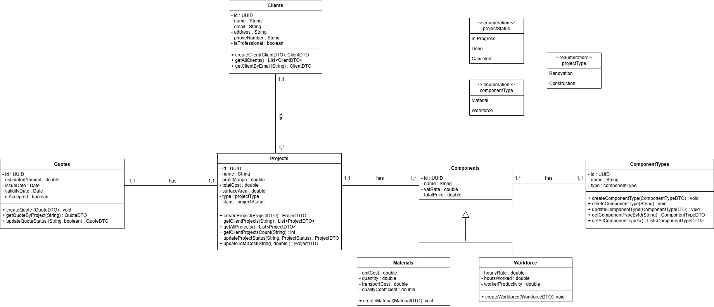

# 🛠️ Welcome to Kostr! 🛠️

Hello, Construction and Renovation Professionals! 👋

Welcome to **Kostr**, your advanced Java-based application tailored to meet the needs of kitchen renovation and construction experts. **Kostr** simplifies the process of managing clients, generating project quotes, and tracking the overall financial and logistical aspects of your kitchen renovation projects.

## 🚀 About Kostr

**Kostr** is designed to provide construction and renovation professionals with an efficient tool for estimating the costs of materials and labor involved in kitchen projects. The application includes advanced features such as client management, personalized quote generation, and an overall view of project finances and logistics. With **Kostr**, you can calculate labor costs by the hour and keep track of materials used, making project estimation and management easier and more accurate.

## 📁 Project Structure

Here's an overview of the project structure for **Kostr**:

- **config**: Handles configuration settings for the application: `DatabaseConnection` , `Session`
- **controllers**: Contains controllers for managing projects, clients, and components.
- **dto**: Includes Data Transfer Objects (DTOs) for passing data between layers.
- **models**: Defines the models representing clients, projects, quotes, materials, components, and workforce.
- **repositories**: Contains repository classes for database operations.
- **services**: Business logic layer for managing core functionalities such as projects, clients, and materials.
- **ui**: Contains the `ConsoleUI` class, which manages user interactions through a console-based interface.
    - `ConsoleUI`: The main console interface for interacting with projects, clients, and components.
- **utils**: Utility classes that handle additional helper functions and validations.
- **resources**: Stores application properties and SQL scripts.
    - `app.properties`: Contains the application's configuration settings such as database details.
    - `Kostr.sql`: SQL file for creating the necessary database schema.

## 🧩 Key Features

- 🛠 **Manage Projects**: Create, view, and manage renovation projects for clients.
- 📑 **Personalized Quotes**: Generate detailed quotes based on materials and hourly labor costs.
- 👥 **Client Management**: Manage client details, including retrieving their associated projects.
- 🔨 **Component Types**: Add, update, delete, or view component types used in renovation projects.
- 📊 **Financial Tracking**: Track the costs associated with each project, including materials and labor.

## 🎨 UML Diagrams

Here's a UML `Class Diagram` to give you a high-level view of the architecture:

[](./src/main/resources/UML.png)


## 🛠️ How to Use Kostr

### Prerequisites

Ensure you have the following installed on your machine:

- **Java 8** or later
- **PostgreSQL** database with the necessary tables and schema (setup instructions below)
- **JDBC Driver** for PostgreSQL
- A console or terminal to run the application

### Installation

1. Clone this repository to your local machine:
   ```bash
   git clone https://github.com/zinebMachrouh/Kostr.git
   cd Kostr

2. Create a PostgreSQL database and run the SQL script to set up the necessary tables:
    ```bash
    psql -U yourusername -d yourdatabase -f resources/Kostr.sql
    ```
   Replace `yourusername` and `yourdatabase` with your PostgreSQL username and the name of the database you want to create.

3. Update the `app.properties` file in the `resources` directory with your database connection details.

### Running the JAR File
To run the application, execute the following command:
```bash
     cd out/artifacts/Kostr_jar
     java -jar Kostr.jar
```


## 🎉 Join the Kostr Family!
Ready to streamline your library management? Jump into ShelfMaster and transform how you manage your library's collections today!

For any questions, feedback, or suggestions, feel free to reach out to us. I'd love to hear from you! 📧